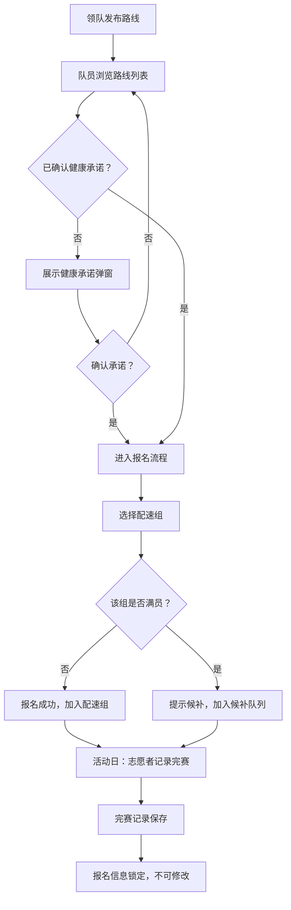

## 1. 产品概述

公益跑团活动管理平台——帮助领队发布跑步路线、队员按配速报名分组、志愿者记录完赛成绩的一站式工具。解决传统微信群接龙混乱、配速分组不透明、完赛数据难以归档的痛点，面向公益跑团组织者和参与者。

## 2. 核心功能

### 2.1 用户角色

| 角色 | 进入方式 | 核心权限 |
|------|----------|----------|
| 领队 | 页面顶部角色切换 | 发布/编辑跑步路线、查看报名与分组 |
| 队员 | 页面顶部角色切换 | 浏览路线、健康承诺确认后报名、查看自己的配速组 |
| 志愿者 | 页面顶部角色切换 | 扫码/选择队员记录完赛、查看完赛统计 |

### 2.2 功能模块

1. **路线发布页**：路线列表、新增/编辑路线表单、路线详情卡片
2. **报名与分组页**：路线报名入口、健康承诺确认弹窗、配速选择与候补提示、分组结果展示
3. **完赛记录页**：完赛登记表单、完赛列表与统计、完赛后报名信息锁定提示

### 2.3 页面详情

| 页面名称 | 模块名称 | 功能描述 |
|----------|----------|----------|
| 路线发布页 | 路线列表 | 展示所有已发布路线卡片，含路线名、距离、时间、已报名/容量 |
| 路线发布页 | 新增路线表单 | 领队填写路线名称、距离、集合地点、出发时间、配速组容量等 |
| 路线发布页 | 路线详情 | 点击卡片展开路线详情，含集合地点描述和配速组一览 |
| 报名与分组页 | 报名入口 | 队员选择路线后弹出健康承诺确认，确认后方可进入报名 |
| 报名与分组页 | 配速选择 | 选择目标配速区间，显示各组剩余名额，满员提示候补 |
| 报名与分组页 | 分组结果 | 以分组卡片展示各组人员名单与候补名单 |
| 完赛记录页 | 完赛登记 | 志愿者选择路线→选择队员→记录完赛时间与备注 |
| 完赛记录页 | 完赛统计 | 完赛人数、各配速组完赛率、完赛时间分布 |
| 完赛记录页 | 信息锁定 | 完赛队员报名信息不可修改，尝试修改时给出锁定提示 |

## 3. 核心流程

**领队发布路线 → 队员浏览并报名（需先确认健康承诺） → 系统按配速自动分组 → 组满进入候补 → 志愿者记录完赛 → 完赛后报名信息锁定**

## 4. 用户界面设计

### 4.1 设计风格

- **主色调**：活力橙 `#FF6B35`，搭配深炭灰 `#1A1A2E` 与柔白 `#FAFAFA`
- **辅助色**：配速组以色环区分——快组翠绿 `#2EC4B6`、中组琥珀 `#E9C46A`、慢组珊瑚 `#F4845F`
- **按钮风格**：圆角大按钮，主按钮填充橙色带微阴影，次按钮描边
- **字体**：标题用 `Outfit`（几何感运动风），正文用 `Noto Sans SC`（中文友好）
- **布局风格**：顶部导航栏 + 角色切换，内容区卡片网格，卡片圆角带悬浮阴影
- **图标风格**：Lucide 线性图标，与运动主题搭配（MapPin、Timer、Trophy、Users 等）
- **装饰元素**：背景使用斜条纹跑道纹理，卡片顶部配渐变色条

### 4.2 页面设计概览

| 页面名称 | 模块名称 | UI元素 |
|----------|----------|--------|
| 路线发布页 | 路线列表 | 网格卡片，每卡顶部渐变色条，路线名大标题，距离/时间标签，底部已报名进度条 |
| 路线发布页 | 新增路线表单 | 模态弹窗，表单输入项带图标前缀，配速组容量用步进器 |
| 报名与分组页 | 健康承诺弹窗 | 全屏遮罩弹窗，承诺文字滚动区，底部确认按钮 |
| 报名与分组页 | 配速选择 | 三列卡片，每列一个配速区间，底部名额数，满员灰显+候补标签 |
| 报名与分组页 | 分组结果 | 手风琴折叠面板，每面板一个配速组，展开显示队员名单 |
| 完赛记录页 | 完赛登记 | 选择路线下拉框→队员列表（可搜索）→完赛时间输入→提交按钮 |
| 完赛记录页 | 完赛统计 | 顶部三个统计数字卡片，下方柱状图展示各配速组完赛率 |

### 4.3 响应式设计

- 桌面优先设计，三列网格布局
- 平板端自适应两列
- 移动端单列堆叠，卡片全宽
- 触控优化：按钮最小点击区域 44px，表单输入框加大

### 4.4 动效设计

- 路线卡片加载时交错淡入上滑（stagger fade-in-up）
- 角色切换时内容区平滑过渡
- 报名成功后卡片微弹跳反馈
- 完赛记录提交后数字计数动画
