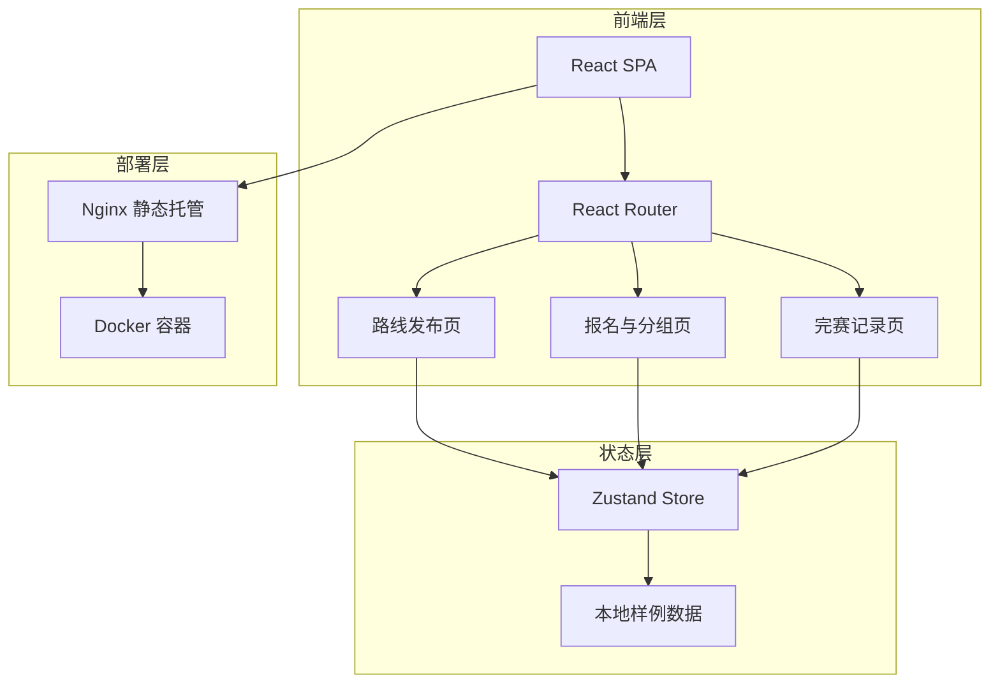
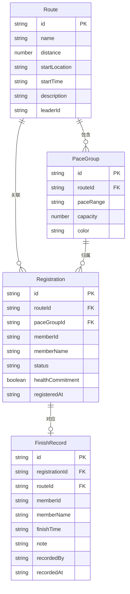

## 1. 架构设计

## 2. 技术说明

- **前端框架**：React 18 + TypeScript
- **构建工具**：Vite
- **样式方案**：Tailwind CSS 3
- **状态管理**：Zustand
- **路由**：React Router DOM v6
- **图标**：lucide-react
- **后端**：无（纯前端，本地样例数据）
- **数据持久化**：localStorage（可选），内存中为样例数据
- **容器化**：Nginx + Docker

## 3. 路由定义

| 路由 | 用途 |
|------|------|
| `/` | 首页/路线发布页（默认） |
| `/registration` | 报名与分组页 |
| `/finish` | 完赛记录页 |

## 4. 数据模型

### 4.1 数据模型定义

### 4.2 数据定义

#### Route 路线

| 字段 | 类型 | 说明 |
|------|------|------|
| id | string | 路线唯一标识 |
| name | string | 路线名称 |
| distance | number | 距离（公里） |
| startLocation | string | 集合地点 |
| startTime | string | 出发时间 |
| description | string | 路线描述 |
| leaderId | string | 领队ID |

#### PaceGroup 配速组

| 字段 | 类型 | 说明 |
|------|------|------|
| id | string | 配速组唯一标识 |
| routeId | string | 所属路线ID |
| paceRange | string | 配速区间（如"5:00-5:30/km"） |
| capacity | number | 容量上限 |
| color | string | 标识颜色 |

#### Registration 报名

| 字段 | 类型 | 说明 |
|------|------|------|
| id | string | 报名唯一标识 |
| routeId | string | 路线ID |
| paceGroupId | string | 配速组ID |
| memberId | string | 队员ID |
| memberName | string | 队员姓名 |
| status | string | 状态：confirmed / waitlist / finished |
| healthCommitment | boolean | 是否已确认健康承诺 |
| registeredAt | string | 报名时间 |

#### FinishRecord 完赛记录

| 字段 | 类型 | 说明 |
|------|------|------|
| id | string | 完赛记录唯一标识 |
| registrationId | string | 关联报名ID |
| routeId | string | 路线ID |
| memberId | string | 队员ID |
| memberName | string | 队员姓名 |
| finishTime | string | 完赛用时 |
| note | string | 备注 |
| recordedBy | string | 记录人（志愿者） |
| recordedAt | string | 记录时间 |

## 5. 业务规则

1. **健康承诺前置**：未确认健康承诺的队员无法进入报名流程，弹窗阻断
2. **配速组满员候补**：报名时若目标配速组已满（confirmed 数 = capacity），自动加入候补（status=waitlist）
3. **完赛后锁定**：队员已有完赛记录时，其报名信息不可修改，前端拦截并提示
4. **角色切换**：通过顶部切换角色，不同角色看到不同操作入口，但数据共享
